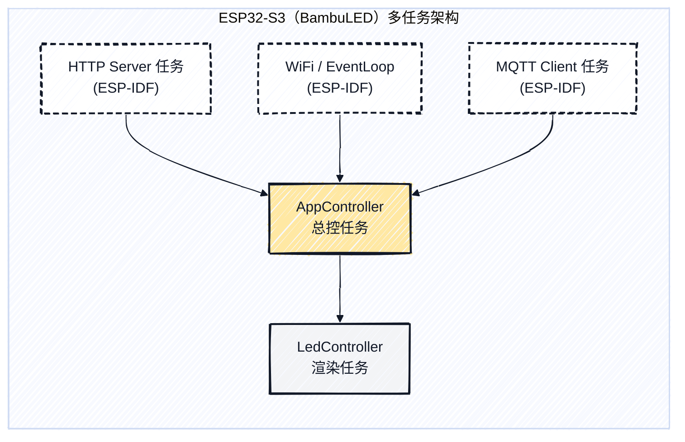
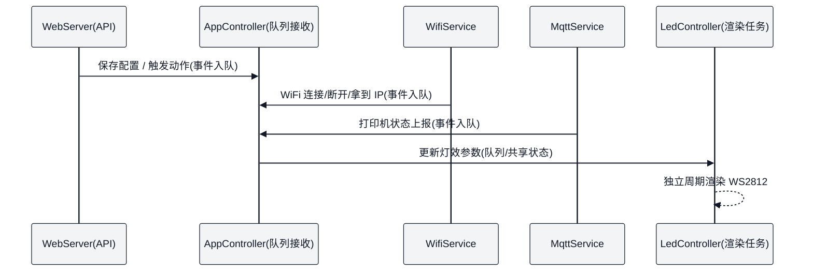

<p align="center">
  
</p>

<h1 align="center">✨ BambuLED</h1>

<p align="center">
  一个基于 <b>ESP32-S3 + WS2812</b> 的拓竹打印机状态联动灯带项目。<br/>
  通过 <b>SoftAP + Captive Portal</b> 网页完成 WiFi / 打印机 MQTT / 灯效配置，设备会根据打印机状态自动切换灯效。
</p>

<p align="center">
  简体中文 · <a href="#快速开始">快速开始</a> · <a href="#配置页面">配置页面</a> · <a href="#排错">排错</a>
</p>

<p align="center">
  
  
  
  
  
  <a href="https://github.com/NingZiXi/BambuLED/stargazers"></a>
  
</p>

---

## 📌 概述

本项目使用 ESP-IDF 原生组件实现：

- **WiFi**：SoftAP 常开 + STA 联网（APSTA），便于手机随时进入配置页
- **Captive Portal**：DNS 劫持 + 探测 URI 兼容处理，支持手机“自动弹出配置页面”
- **MQTT**：连接拓竹打印机本地 MQTT，订阅 `device/<serial>/report` 获取状态
- **WS2812**：灯带独立渲染任务，多灯效 + 进度条 + 状态映射
- **NVS**：持久化保存 WiFi / 打印机 / 灯效配置

## ✨ 功能

- 网页配置（3 个菜单）：**WiFi 配置 / 连接打印机 / 灯光设置**
- WiFi 流程：点击“连接 WiFi”后先尝试连接，成功才进入重启流程；失败会在页面提示
- 打印机连接：支持本地 MQTT（默认 **8883 + TLS**），用户名固定 `bblp`，密码为打印机访问码
- 灯效支持：常亮 / 呼吸 / 渐变 / 跑马 / 彩虹 / 进度条 / 闪烁 / 关闭
- 状态映射：每个打印状态都可单独配置“灯效 + 速度 + 颜色”，并支持“关闭”
- 舱灯联动：可根据打印机上报的 `system.ledctrl`（chamber_light/chamber_light2）联动 WS2812

## 🧱 架构



### 🧵 多任务架构

- AppController 作为“总控任务”，接收 WiFi/MQTT/Web 的事件，统一做状态机与灯效映射
- LedController 作为“渲染任务”，专注输出 WS2812 像素数据（避免 UI/网络抖动影响灯效）

### 📬 任务队列通信流程


<a id="快速开始"></a>
## 🚀 快速开始

### 1️⃣ 编译与烧录

```bash
idf.py set-target esp32s3
idf.py build
idf.py -p COM3 flash monitor
```

### 2️⃣ 进入配置页面

- 手机上连接热点：`BambuLED-XXXX`
- 大多数手机会自动弹出配置页；若未弹出，手动打开：
  - `http://192.168.4.1/`

### 3️⃣ 配置 WiFi / 打印机 / 灯光

- **WiFi 配置**：填写 2.4GHz WiFi，点“连接 WiFi”
- **连接打印机**：填写打印机 IP / 访问码 / 序列号（每个字段都有问号提示）
- **灯光设置**：按状态自定义灯效与颜色（每个状态支持“关闭”）

<a id="配置页面"></a>
## 🧭 配置页面

页面入口：
- `GET /`：配置首页（静态 HTML，已嵌入固件）
- `GET /api/config`：读取当前配置与状态
- `POST /api/config`：保存 WiFi / 打印机 / 灯光配置（支持局部提交）
- `POST /api/wifi/disconnect`：断开当前 WiFi（不重启）

## 🎛️ 状态说明（系统灯效）

- WiFi 未连接：蓝色呼吸（更偏蓝）
- WiFi 已连接但 MQTT 断开：粉色呼吸
- 打印机状态联动：按 Idle/Heating/Printing/Finished/Paused/Alert 映射
- 舱灯联动：如果上报过舱灯状态，则按舱灯开/关覆盖灯带显示

<a id="排错"></a>
## 🧰 排错

### WiFi

- 手机能连热点但不自动弹窗：尝试手动打开 `http://192.168.4.1/`
- 点击“连接 WiFi”后失败：检查 SSID/密码是否正确、是否为 2.4GHz

### MQTT

- 本地 MQTT 常见配置：`mqtts://<printer_ip>:8883`（TLS 开启）
- 如果无法连接：确认打印机已开启 LAN 模式/开发者模式，并检查访问码/序列号

### WS2812

- GPIO 是否正确、是否共地、供电是否足够
- 若颜色不对：注意 WS2812 为 GRB 顺序（项目已按 GRB 配置）

---

## 📄 许可证

本项目基于 MIT License 开源，详情请参阅 [LICENSE](LICENSE) 文件


## ❤️ 支持项目

如果 BambuLED 对你有帮助，欢迎赞助一杯咖啡☕，支持持续开发与更新～

<p align="center">
  <a href="https://ifdian.net/a/NingZiXi" target="_blank">
    
  </a>
</p>

<p align="center">也可以微信或支付宝直接扫码赞赏</p>
<p align="center">
  
</p>

## 🤝 贡献

欢迎提交 Issue / PR 来完善本项目（功能、兼容性、文档与排错经验都很有价值）。

**📈 Star History**
[](https://star-history.com/#NingZiXi/BambuLED&Date)

**👤 贡献者**
<p align="center">
  <a href="https://github.com/NingZiXi/BambuLED/graphs/contributors">
    
  </a>
</p>

<p align="center">
感谢您使用 BambuLED！<br/>
如果这个项目对您有帮助，欢迎点个 ⭐ Star 支持一下！
</p>
